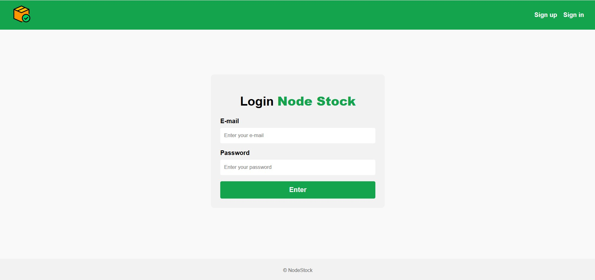
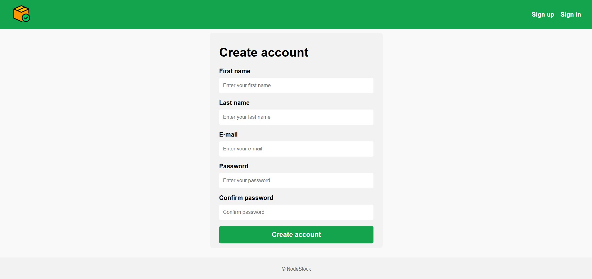
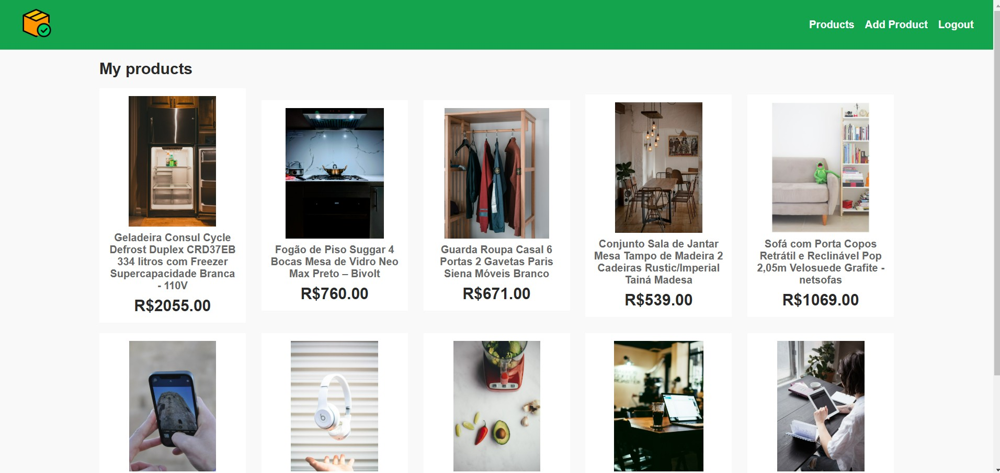
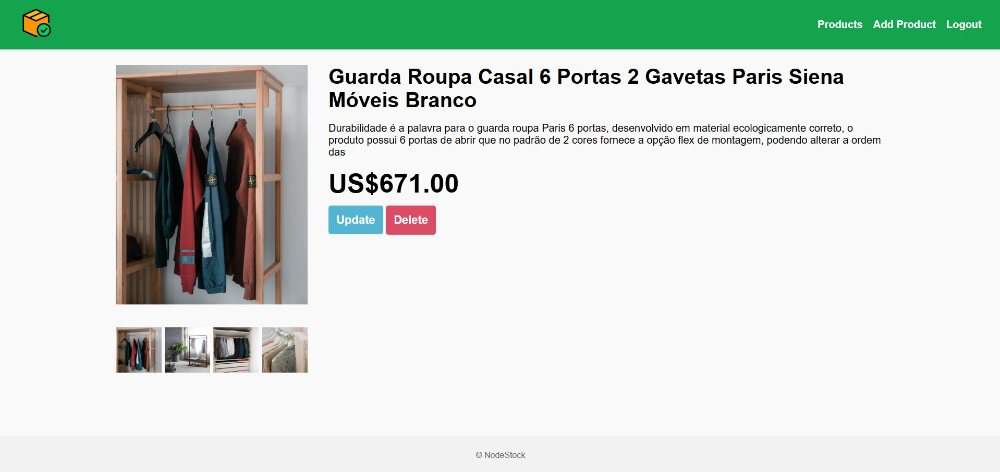
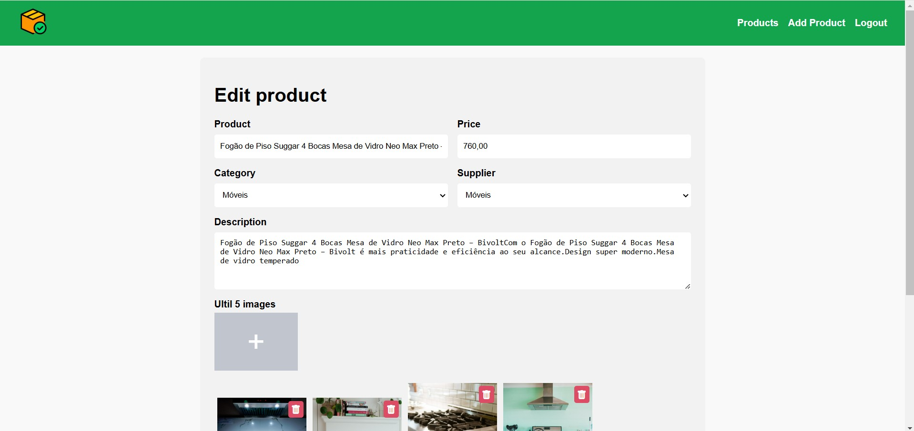

# Node Stock

A simple stock management application built with Node.js and MySQL.

## Table of Contents

- [About](#about)
- [Features](#features)
- [Technologies](#technologies)
- [Screenshots](#screenshots)
- [Contact](#contact)

## About

Node Stock is a straightforward stock management system that allows users to create accounts, log in, add products, view listed products, see product details, edit products, and delete products. This project is designed to be simple yet functional, leveraging the power of Node.js and MySQL.

## Features

- Create account
- Log in
- Add product
- View listed products
- See product details
- Edit product
- Delete product

## Technologies

- Node.js
- JavaScript
- CSS (BEM methodology)
- Handlebars
- Express
- MySQL
- Sequelize

## Screenshots

### Login Page

### Sign Up Page

### Product List

### Product Details

### Edit Product

## Contact

For any inquiries or questions, please contact me at:

- Email: [jordanwillian.ecp@gmail.com](mailto:jordanwillian.ecp@gmail.com)
